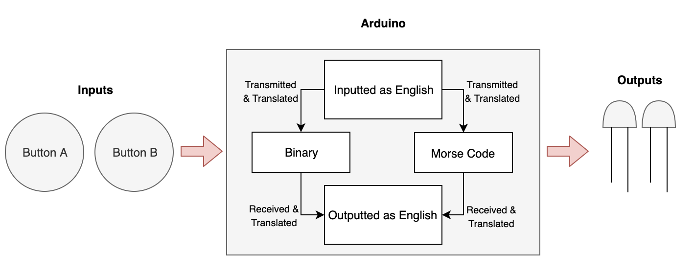
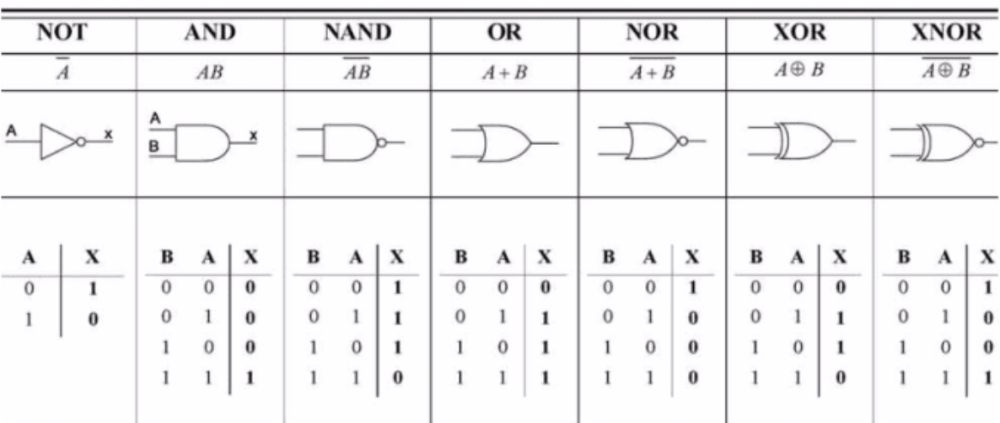
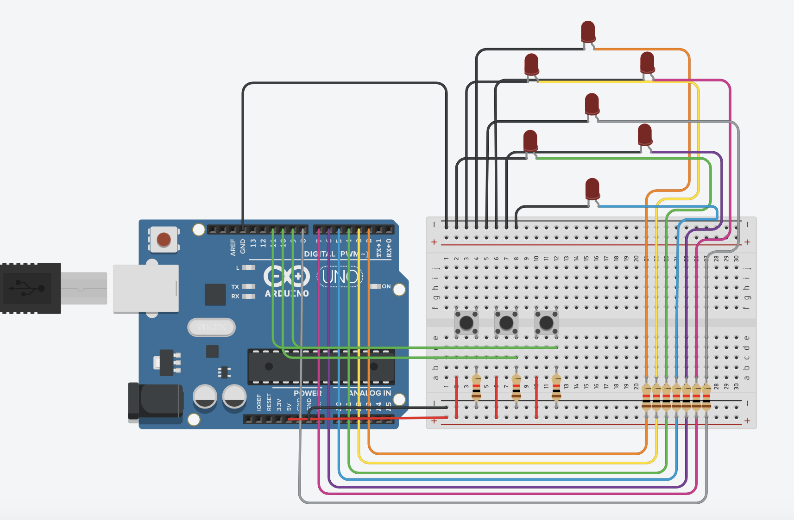
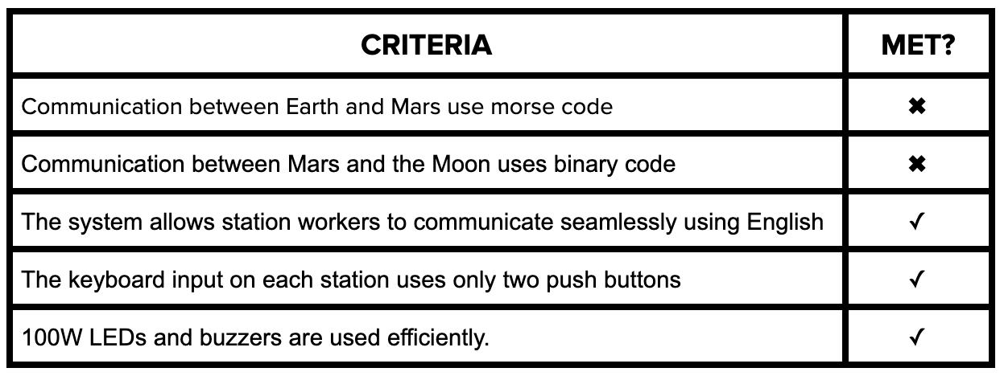

Unit 2
======

An English, morse, and binary translation program to theoretically enable communication between Earth, the Moon, and Mars, coded in Modern C and run on an Arduino UNO. 

Contents
-----
  1. [Planning](#planning)
  1. [Design](#design)
  1. [Development](#development)
  1. [Evalution](#evaluation)
  1. [Citations](#citations)

Planning
----------
**Defining the Problem:**

It's 2050. Humans have made it to Mars; however, communication between Mars, the Moon, and Earth has become a big issue. Despite the massive technological improvements made in order to get to Mars, it has proven difficult for NASA to send enough supplies to the planetary bodies. Thus, each location only has transmittors and receivers only capable of receiving and sending two pieces of information. 

For Mars, the planet is only able to send and receive binary. For Earth, the planet is only able to send and receive morse code. The Moon, therefore, acts as a liason between the two planets and works to translate Morse code into binary or the opposite. However, the operators in these planets can only understand English so each language must be translated into English before being transmitted. 

I propose a new Arduino based system which would have a variety of functions as listed in the Success Criteria. This system hopes to be as simple to use as possible so it can easily be edited and also does not require a lot of resources, something necesarry in an unfamiliar and far planet. In addition, the system needs to be easy to initiate, making it simple enough to create on the Moon and Mars. 

**Proposed Solution:**

I will create a Modern C program to address these issues. Modern C is being used because NASA needs to further develop a communication system which makes efficient use of the limited supplies on the Moon and Mars and Modern C doesn't require very rugged hardware to be run. Compared to my previous Project 1 repository, there are a few main resources in whhich Modern C is being used in addition to the fact that it is what we are learning in class currently: 

| Modern C        | Bash           | 
| :-----------: |:-------------:| 
| Syntax is more forgiving     | More capable | 
| More resources online      | Runs directly on computer with installation      |   
| Integrated with hardware (Arduino) | Integrated with computer and can perform actions within OS      | 

The client in this case, NASA, needs to be able to translate binary, morse code, and English. To create a system which performs these actions, we propose a program in which the operator inputs the message through English through two buttons which cycle through an array on a LCD display. From there, the message is translated using a program which converts it to binary or morse code and communicates it to the other planet. From there, the morse or binary is translated back into English and displayed to the operator there. From this, we can form a set of success criteria to guide our progress through this misison.

**Success Criteria:**

1. Communication between Earth and Mars uses Morse code.
2. Communication between Mars and the Moon uses Binary code.
3. A communication system that allow station workers to communicate seamlessly using English.
4. Keyboard input on each station is limited to 2 push buttons. 
5. 100W lights and buzzers are used efficiently.

Design
------

**System Diagram:**

**Fig. 1:** System diagram showing inputs and outputs

My task specifically here is to ask as the translator on planet Earth, meaing that I need to be able to translate between morse code and English. 

**Modern C:**

Obtaining a basic understanding or Modern C is essential to being able to design an effective system which can translate binary, English, and morse code. In order to get started with this, let's take a look at the different types of integers within Modern C:
1. A boolean is a variable which can only hold two values, true or false which only uses 1 byte. 
2. A float is a number which has a decimal point which is stored as 4 bytes. 
3. A word stores an unsigned number from 0 to 65,535.
4. A long is an extended numerical variable which covers from -2,147,483,648 to 2,147,483,647.
5. A char stores a single character as a value. 
6. An unsigned char encodes numbers from 0 to 255. 
7. An int stores an integer from -32,768 to 32,767. 
8. An unsigned int is the same as an int yet it lacks the negative values, resulting in it ranging from 0 to 65,535.

These eight types of variables enable us to cast a wide net and find a variable which meets our own particular needs. While some of they may be multifunctional, it is best to find the one best directed for our needs in order to minimize the memory used storing our variable. 

Another interesting function with Modern C is "void," used for declaring functions. It ensures that the function is expected not to have an output back to its original function. 

**Usability & Human-centered Design (HCD)**

Usability is essentially how easily something can be learned and used [1], specifically for a human-made technology. This is especially relevant to concepts such as something being intuitive, elegant, or clear. At the core of human-centered design is feedback and discoverability [2].

For such a endeavor such as initiating communication between Earth, the Moon, and Mars, it is crucial for the final product to be intuitive and easy to use. This way, time is not spent learning how to use the product, but rather spent on actually sending messages.

Development
-----------
**1. Counting with binary:**

We first learned to count with binary, a necessary step for converting data from English to binary and vice versa. Essentially, in binary, you start off by representing zero as one. Then, whenever the last digit is zero, you change the number to one. 

This strategy yields us the number zero as 0 and the number one as 1. From there, however, it gets slightly more complicated. Whenever the last digit is one, then you add another one which would result in 2 but is formatted as 10. Thus, number three would be represented as 10. From there on, the same strategy could be used to receive all the numbers from zero to fifteen: 0, 1, 10, 11, 100, 101, 110, 111, 1000, 1001, 1010, 1011, 1100, 1101, 1110, 1111. 

**2. Representing numbers in binary through LED lights:**

How many led lights do you need to show the numbers from 1 to 15? Have two led lights. Flash red for one, flash white for zero.

We began to answer this question by seeing how Arduino can be used to make a single LED flash. Here, we can see an LED flashing: 


**Fig. 1** This gif shows a single LED flashing, run on the code below.

While Fig 1 only simply shows a single flash, the program can be adjusted for additional LEDs and also for different timed pulses of light. The code is quite simple for something such as a single light flash:
```.ino
int redLED = 13;

void setup() {
  pinMode(redLED, OUTPUT);
  
}

void loop() {
  blinkRed(1000);
  blinkRed(100);
}

void blinkRed(int t){
  digitalWrite(redLED, HIGH);
  delay(t);
  digitalWrite(redLED, LOW);
  delay(t);
}
```

**3. Using buttons to trigger lights:**

Using an Arduino, we can use buttons to trigger lights. While this can simply be done by using a large amount of "if else" statements, this problem can also be solved quite easily with logic gates. By noticing patterns in between inputs and outputs, the logic gates of "or," "and," "not," and "xor" can be used to simplify an equation for the output. 

For example, in a scenario in which Button A and Button B not being pressed or just Button A being pressed results in a light being pressed, the following code could be created: ` if(digitalRead(!butB)==HIGH); digitalWrite(out1, HIGH);}`.
These logical gates can be used for a variety of other outputs as well as detailed further in this document. 

**4. Converting from decimal to a seven segment number:**

Since this project is based around converting numbers from decimal to binary and morse code, and vice versa, it is useful to practice the use of logic gates by creating a system in which decimal numbers are converted to a seven segment number. To do this, we essentially made a table in which 

**Table 1** This table 

| Button A  | Button B    | Button C     | Decimal Number | A | B | C | D | E | F | G |
| :----: |:----:| :----:|:----:|:----:|:----:|:----:|:----:|:----:|:----:|:----:|
| 0 | 0 | 0 | 0 | 1 | 1 | 1 | 1 | 1 | 1 | 0 |
| 0 | 0 | 1 | 1 | 0 | 0 | 0 | 0 | 1 | 1 | 0 |
| 0 | 1 | 0 | 2 | 1 | 0 | 1 | 1 | 0 | 1 | 1 |
| 0 | 1 | 1 | 3 | 1 | 0 | 0 | 1 | 1 | 1 | 1 |
| 1 | 0 | 0 | 4 | 0 | 1 | 0 | 1 | 1 | 1 | 1 |
| 1 | 0 | 1 | 5 | 1 | 1 | 0 | 1 | 1 | 0 | 1 |
| 1 | 1 | 0 | 6 | 1 | 1 | 1 | 1 | 1 | 0 | 1 |
| 1 | 1 | 1 | 7 | 1 | 0 | 0 | 0 | 0 | 1 | 1 |

Using this table, we can create equations for each LED in the seven segment number (see image below for an example).


**Fig. 2** This is a seven segment number, 

When you make equations using the logic gates learned earlier, you can form one individual equation and then put set that equal to a boolean to minimize the number of lines needed to code the program. The following code effectively uses logic gates to make a system which lights up a seven-segment number by using three inputs (buttons; base three system) and uses binary. The logic gates used to create this equations are shown here:


**Fig. 3** The logic gates as shown above can address

Below is the code for lighting up a seven segment number using a base three system. 

```.ino
int portA = 8;
int portB = 9;
int portC = 10;
int outA = 1;
int outB = 2;
int outC = 3;
int outD = 4;
int outE = 5;
int outF = 6;
int outG = 7;

void setup()
{
  pinMode(portA, INPUT);
  pinMode(portB, INPUT);
  pinMode(portC, INPUT);
  pinMode(outA, OUTPUT);
  pinMode(outB, OUTPUT);
  pinMode(outC, OUTPUT);
  pinMode(outD, OUTPUT);
  pinMode(outE, OUTPUT);
  pinMode(outF, OUTPUT);
  pinMode(outG, OUTPUT);    
}

void loop()
{
    bool A = digitalRead(portA);
  	bool B = digitalRead(portB);
  	bool C = digitalRead(portC);
  
  // equation for LED A:
  bool eqA = B || (!A && !C) || (A && C);
  	digitalWrite(outA, eqA);
  
  // equation for LED B:
  bool eqB = (A && !B) || (A && !C) || (!B && !C);
  	digitalWrite(outB, eqB);
  
  // equation for LED C:
  bool eqC = (!A && !C) || (B && !C);
  	digitalWrite(outC, eqC);
  
  // equation for LED D:
  bool eqD = (!A && !C) || (!A && B) || (A && B && !C) || (A && !B && C);
  	digitalWrite(outD, eqD);
  
  // equation for LED E:
  bool eqE = C || A || (!A && !B);
  	digitalWrite(outE, eqD);
  
  // equation for LED F:
  bool eqF = !A || (B && C) || (A && !B && !C);
  	digitalWrite(outF, eqF);
  
  // equation for LED G:
  bool eqG = (B && !C) || (A && !B) || (!A && B);
  	digitalWrite(outG, eqG);
}
  ```
  
Here is the circuit for the code above: 


**5. English Input System:**

In our program, it is important for the operators to be able to input and receive in English. However, since we only have two buttons as an input, we have to develop an English input system which is different from a traditional keyboard, instead using two buttons. 

Our first edition was made using a matrix; however, it wasn't able to be fully completed because it is difficult or maybe even impossible to represent a matrix on a 16 by 2 LCD display which was given to us. 

Our second edition as seen below, supplied by our teacher, utilizes interrupt functions to effectively achieve our goal. The program calibrates an LCD screen and then and then, using the interrupt functions, used two buttons to cycle through the letters in the array.

The first key portion of this program is the array. It is used to define a set of arguments that will be used in the program, eventually becoming a string. In an array, the number of arguments also needs to be defined as it is put inside of the brackets. Arguments are separated with commas and in ' '. 

Another crucial part of this program is the interruptions. Rather than checking if a button is pressed with if-then statements, we can have the Arduino run other processes and then interupt this procces when the button on pin 2 or 3 is pressed. After an interuption, the Arduino goes back to the process which was running before interuption.

The code below can also be represented with the following flow diagram: 


```.ino
// include the library code:
#include <LiquidCrystal.h>
int index = 0; 
// add all the letters and digits to the keyboard
String keyboard[]={"A", "B", "C", "D", "SENT", "DEL"};
String text = "";
int numOptions = 6;

// initialize the library with the numbers of the interface pins
LiquidCrystal lcd(12, 11, 5, 4, 9, 8);

void setup() {
  // set up the LCD's number of columns and rows:
  lcd.begin(16, 2);
  // Print a message to the LCD.
  attachInterrupt(0, changeLetter, RISING);//button A in port 2
  attachInterrupt(1, selected, RISING);//button B in port 3
}

void loop() {
  // set the cursor to column 0, line 1
  // (note: line 1 is the second row, since counting begins with 0):
  lcd.clear();
  lcd.setCursor(0, 0);
  lcd.print(keyboard[index]);
  lcd.setCursor(0, 1);
  lcd.print(text);
  delay(100);
}

//This function changes the letter in the keyboard
void changeLetter(){
  static unsigned long last_interrupt_time = 0;
  unsigned long interrupt_time = millis();
  if (interrupt_time - last_interrupt_time > 200)
  {
  
    last_interrupt_time = interrupt_time;// If interrupts come faster than 200ms, assum
    index++;
      //check for the max row number
    if(index==numOptions){
      index=0; //loop back to first row
    } 
 }
}

//this function adds the letter to the text or send the msg
void selected(){
  static unsigned long last_interrupt_time = 0;
  unsigned long interrupt_time = millis();
  if (interrupt_time - last_interrupt_time > 200)
  {
  
    last_interrupt_time = interrupt_time;// If interrupts come faster than 200ms, assum
    
    String key = keyboard[index];
    if (key == "DEL")
    {
      int len = text.length();
      text.remove(len-1);
    }
    else if(key == "SENT")
    {
      text="";
    }else{
      text += key;
    }
    index = 0; //restart the index
  }
}
 ```
 
Evaluation
----------

**Fulfillment of Success Criteria:**


**Fig. 5:** Shows the completion of success criteria for this project. The infrastructure for this project was completed as seen by how the operators were able to communicate in English, there were only two inputs, and lights/buzzers have been used sparingly and efficiently. While we weren't able to communicate in morse and binary between the planetary bodies yet, we were able to create the infrastructure for creating these programs, This provides us room in the future to continue developing these sections and as a result, meeting our client's needs. 

As of right now, our program has the English input system in which two inputs are used -- the program and the circuitry have both been documented for this in the development section. 

**Future Improvements:**
While this project has been fairly fleshed out, there is still a lot of work that needs to be done in order to achieve full functionality. Firstly, actually establishing a translation system from English to binary and morse code is necesarry to finish the communication system. While the binary translation formula has been researched, further information on morse code needs to be gathered. From there, this translation system needs to be incorporated with the rest of the already developed code. 

Once all of these success criteria are finished, there are other aspects of the program which could be simply improved for the future. Firstly, efficiency could be improved so that the words per minute communicated would be increased. This could be done by simply increasing the number of inputs or, within the English input system, making it so that one can cycle through the arrays by going either left or right instead of just right. This would make it quicker to reach the wanted character and then make messages sent quicker.

In addition, an autopredictive system for words would improve the system. This system could use patterns in phrases or artificial intelligence to predict the wanted word or sentence, thus making the system more efficient. 

Citations
---------
https://www.wikihow.com/Count-in-Binary
https://stackoverflow.com/questions/1043034/what-does-void-mean-in-c-c-and-c/1043107
https://www.arduino.cc/en/Reference/VariableDeclaration
https://www.arduino.cc/reference/tr/#variables
https://javascript.info/logical-operators
https://circuitdigest.com/microcontroller-projects/7-segment-display-interfacing-with-arduino

References:
[1] "What is Usability?" retreived from https://www.interaction-design.org/literature/topics/usability (25 Nov 2019)
[2] Posner, Joe and Mars, Romam "It's not you. Bad doors are everywhere." 2016. Retrieved (25 Nov 2019)
