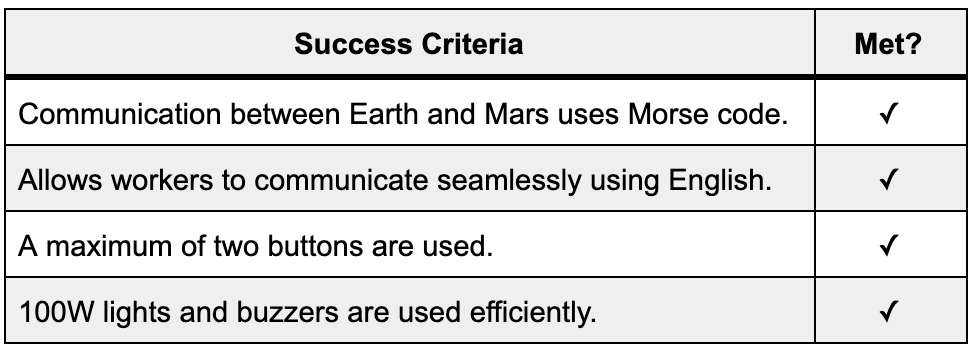

Unit 2: Interplanetary Communication System 
======

An English, morse, and binary translation program to theoretically enable communication between Earth, the Moon, and Mars, coded in Modern C and run on an Arduino UNO. 

Contents
-----
  1. [Planning](#planning)
  1. [Design](#design)
  1. [Development](#development)
  1. [Evalution](#evaluation)
  1. [Citations](#citations)

Planning
----------
**Defining the Problem:**

It's 2050. Humans have made it to Mars; however, communication between Mars, the Moon, and Earth has become a big issue. Despite the massive technological improvements made in order to get to Mars, it has proven difficult for NASA to send enough supplies to the planetary bodies. Thus, each location only has transmittors and receivers only capable of receiving and sending two pieces of information. 

For Mars, the planet is only able to send and receive binary. For Earth, the planet is only able to send and receive morse code. The Moon, therefore, acts as a liason between the two planets and works to translate Morse code into binary or the opposite. However, the operators in these planets can only understand English so each language must be translated into English before being transmitted. 

I propose a new Arduino based system which would have a variety of functions as listed in the Success Criteria. This system hopes to be as simple to use as possible so it can easily be edited and also does not require a lot of resources, something necesarry in an unfamiliar and far planet. In addition, the system needs to be easy to initiate, making it simple enough to create on the Moon and Mars. The Arduino also works for all sorts of operation systems (MacOS, Windows, Linux, etc.) and comes with open-source software that allows us to run programs without having to pay extra for certain capabilities. 

**Proposed Solution:**

I will create a Modern C program to address these issues. Modern C is being used because NASA needs to further develop a communication system which makes efficient use of the limited supplies on the Moon and Mars and Modern C doesn't require very rugged hardware to be run. Modern C is also being used because of it's additionally capacities compared to Bash. As more of a modern language, it has many more capabilities and is able to run easily. Despite that it is slightly more complex than Bash, it will be used by primarily engineers and/or astronauts so this should not pose an issue. Lastly, using Modern C is more advantageous because of the resources available online and the fact that the language is what we are currently learning in class.  

Additionally, we are using GitHub and Tinkercad for this project because of their extensive capabilities. GitHub allows us easily store all of our scripts and documentation. In addition, it's open-source nature allows us to share this information with others. Meanwhile, Tinkercad is especially helpful because it is free and it allows us to virtually simulate our programs on the Arduino. This way, we can test our programs even when we lack access to an Arduino.

**Table 1:** Shows the differences between Modern C and Bash so that the two lanauges can be evaluated against each other.

| Modern C        | Bash           | 
| :-----------: |:-------------:| 
| Syntax is more forgiving     | More capable | 
| More resources online      | Runs directly on computer with installation      |   
| Integrated with hardware (Arduino) | Integrated with computer and can perform actions within OS      | 

The client in this case, NASA, needs to be able to translate binary, morse code, and English. To create a system which performs these actions, we propose a program in which the operator inputs the message through English through two buttons which cycle through an array on a LCD display. From there, the message is translated using a program which converts it to binary or morse code and communicates it to the other planet. From there, the morse or binary is translated back into English and displayed to the operator there. From this, we can form a set of success criteria to guide our progress through this misison.

**Success Criteria:**

1. Communication between Earth and Mars uses Morse code.
2. A communication system that allow station workers to communicate seamlessly using English.
3. Keyboard input on each station is limited to 2 push buttons. 
4. 100W lights and buzzers are used efficiently.

Design
------

**System Diagram:**


**Fig. 1:** Rudimentary system diagram showing inputs and outputs of the proposed system. The Arduino is also shown and it's functions, while elementary, are explained. 

My task specifically here is to ask as the translator on planet Earth, meaing that I need to be able to translate between morse code and English. That would mean that my team is responsible solely for utilizing two buttons to input as English and transmit and translate into morse code. I would also need to be able to receive and translate and morse code. Then, this would be displayed through the two LED outputs. I would not, however, be responsible for any of the components related to the "binary" rectangle on the left side of the Arduino as pictured in Figure 1.  

**Testing Plan:** 


**Fig. 2:** The testing protoccol for ensuring that the Morse to English translation system functions properly. This test would make sure that the letters are able to come up on the screen and that both the delete and reset function works correctly. This protoccol will be used in the evaluation section. 


**Fig. 3:** The testing protoccol for ensuring that the English to Morse translation system functions properly. This test would make sure that the letters are able to be communicated through the two LEDs and that the delete function works corrrectly. This protoccol will be used in the evaluation section. 


**Modern C:**

Obtaining a basic understanding or Modern C is essential to being able to design an effective system which can translate binary, English, and morse code. In order to get started with this, let's take a look at the different types of integers within Modern C [1](#Citations)
1. A boolean is a variable which can only hold two values, true or false which only uses 1 byte. 
2. A float is a number which has a decimal point which is stored as 4 bytes. 
3. A word stores an unsigned number from 0 to 65,535.
4. A long is an extended numerical variable which covers from -2,147,483,648 to 2,147,483,647.
5. A char stores a single character as a value. 
6. An unsigned char encodes numbers from 0 to 255. 
7. An int stores an integer from -32,768 to 32,767. 
8. An unsigned int is the same as an int yet it lacks the negative values, resulting in it ranging from 0 to 65,535.

These eight types of variables enable us to cast a wide net and find a variable which meets our own particular needs. While some of they may be multifunctional, it is best to find the one best directed for our needs in order to minimize the memory used storing our variable. 

Another interesting function with Modern C is "void," used for declaring functions. It ensures that the function is expected not to have an output back to its original function. 

**Usability & Human-centered Design (HCD)**

Usability is essentially how easily something can be learned and used [2](#Citations), specifically for a human-made technology. This is especially relevant to concepts such as something being intuitive, elegant, or clear. At the core of human-centered design is feedback and discoverability [3](#Citations).

For such a endeavor such as initiating communication between Earth, the Moon, and Mars, it is crucial for the final product to be intuitive and easy to use. This way, time is not spent learning how to use the product, but rather spent on actually sending messages.

Development
-----------
**1. Counting with binary:**

We first learned to count with binary [4](#Citations), a necessary step for converting data from English to binary and vice versa. Essentially, in binary, you start off by representing zero as one. Then, whenever the last digit is zero, you change the number to one. For other numerical systems such as base four, the base is four rather than two as it is with binary. Thus, you would replace the last digit, three, with zero. This pattern applies similarly to any other base numerical counting systems.


**2. Representing numbers in binary through LED lights:**

How many led lights do you need to show the numbers from 1 to 15? Have two led lights. Flash red for one, flash white for zero.

We began to answer this question by seeing how Arduino can be used to make a single LED flash. Here, we can see an LED flashing: 


**Fig. 2:** This gif shows a single LED flashing, run on the code below.

While Fig 2 only simply shows a single flash, the program can be adjusted for additional LEDs and also for different timed pulses of light. The code is quite simple for something such as a single light flash:
```.ino
int redLED = 13;

void setup() {
  pinMode(redLED, OUTPUT);
  
}

void loop() {
  blinkRed(1000);
  blinkRed(100);
}

void blinkRed(int t){
  digitalWrite(redLED, HIGH);
  delay(t);
  digitalWrite(redLED, LOW);
  delay(t);
}
```

**3. Using buttons to trigger lights:**

Using an Arduino, we can use buttons to trigger lights. While this can simply be done by using a large amount of "if else" statements, this problem can also be solved quite easily with logic gates. By noticing patterns in between inputs and outputs, the logic gates of "or," "and," "not," and "xor" can be used to simplify an equation for the output. 

For example, in a scenario in which Button A and Button B not being pressed or just Button A being pressed results in a light being pressed, the following code could be created: ` if(digitalRead(!butB)==HIGH); digitalWrite(out1, HIGH);}`.
These logical gates can be used for a variety of other outputs as well as detailed further in this document. 

**4. Converting from decimal to a seven segment number:**

Since this project is based around converting numbers from decimal to binary and morse code, and vice versa, it is useful to practice the use of logic gates by creating a system in which decimal numbers are converted to a seven segment number. To do this, we essentially made a table in which 

**Table 2:** The first step necesarry to take when creating the logic operator equations for a seven segment equation: creating a truth table.  

| Button A  | Button B    | Button C     | Decimal Number | A | B | C | D | E | F | G |
| :----: |:----:| :----:|:----:|:----:|:----:|:----:|:----:|:----:|:----:|:----:|
| 0 | 0 | 0 | 0 | 1 | 1 | 1 | 1 | 1 | 1 | 0 |
| 0 | 0 | 1 | 1 | 0 | 0 | 0 | 0 | 1 | 1 | 0 |
| 0 | 1 | 0 | 2 | 1 | 0 | 1 | 1 | 0 | 1 | 1 |
| 0 | 1 | 1 | 3 | 1 | 0 | 0 | 1 | 1 | 1 | 1 |
| 1 | 0 | 0 | 4 | 0 | 1 | 0 | 1 | 1 | 1 | 1 |
| 1 | 0 | 1 | 5 | 1 | 1 | 0 | 1 | 1 | 0 | 1 |
| 1 | 1 | 0 | 6 | 1 | 1 | 1 | 1 | 1 | 0 | 1 |
| 1 | 1 | 1 | 7 | 1 | 0 | 0 | 0 | 0 | 1 | 1 |

Using this table, we can create equations for each LED in the seven segment number (see image below for an example).


**Fig. 3:** A seven segment number with the proper corresponding letters to Table 2. 

When you make equations using the logic gates learned earlier, you can form one individual equation and then put set that equal to a boolean to minimize the number of lines needed to code the program [5](Citations). The following code effectively uses logic gates to make a system which lights up a seven-segment number by using three inputs (buttons; base three system) and uses binary. The logic gates used to create this equations are shown here:


**Fig. 4:** The logic gates as shown above can address a variety of different functions and are necessary to create an efficient seven segment display [6](Citations). 

Below is the code for lighting up a seven segment number using a base three system. 

```.ino
int portA = 8;
int portB = 9;
int portC = 10;
int outA = 1;
int outB = 2;
int outC = 3;
int outD = 4;
int outE = 5;
int outF = 6;
int outG = 7;

void setup()
{
  pinMode(portA, INPUT);
  pinMode(portB, INPUT);
  pinMode(portC, INPUT);
  pinMode(outA, OUTPUT);
  pinMode(outB, OUTPUT);
  pinMode(outC, OUTPUT);
  pinMode(outD, OUTPUT);
  pinMode(outE, OUTPUT);
  pinMode(outF, OUTPUT);
  pinMode(outG, OUTPUT);    
}

void loop()
{
    bool A = digitalRead(portA);
  	bool B = digitalRead(portB);
  	bool C = digitalRead(portC);
  
  // equation for LED A:
  bool eqA = B || (!A && !C) || (A && C);
  	digitalWrite(outA, eqA);
  
  // equation for LED B:
  bool eqB = (A && !B) || (A && !C) || (!B && !C);
  	digitalWrite(outB, eqB);
  
  // equation for LED C:
  bool eqC = (!A && !C) || (B && !C);
  	digitalWrite(outC, eqC);
  
  // equation for LED D:
  bool eqD = (!A && !C) || (!A && B) || (A && B && !C) || (A && !B && C);
  	digitalWrite(outD, eqD);
  
  // equation for LED E:
  bool eqE = C || A || (!A && !B);
  	digitalWrite(outE, eqD);
  
  // equation for LED F:
  bool eqF = !A || (B && C) || (A && !B && !C);
  	digitalWrite(outF, eqF);
  
  // equation for LED G:
  bool eqG = (B && !C) || (A && !B) || (!A && B);
  	digitalWrite(outG, eqG);
}
  ```
  
Here is the circuit for the code above: 


**Fig. 5:** The circuit used to run a seven segment display on, compatible with the code as seen above. 

**5. The Machine Cycle:**

The machine cycle is the cycle that a processor runs whenever an instruction is given. It is the most basic foundation for the central processing unit (CPU). Modern CPUs run millions of these cycles per second. The cycle consists of three functions:
1. Fetch
The computer fetches the instruction from the RAM. 

2. Decode
When decoding, there is always a marker that says what the action to take is. Then, the rest of the message consists of the actual data to perform the action on.

3. Execute
From here, the actual action can be performed.

Within the CPU, registers (very small memory storage containers) are used in order to house the different instructions and data.

**6. English Input System:**

In our program, it is important for the operators to be able to input and receive in English. However, since we only have two buttons as an input, we have to develop an English input system which is different from a traditional keyboard, instead using two buttons. 

Our first edition was made using a matrix; however, it wasn't able to be fully completed because it is difficult or maybe even impossible to represent a matrix on a 16 by 2 LCD display which was given to us. 

Our second edition as seen below, supplied by our teacher, utilizes interrupt functions to effectively achieve our goal. The program calibrates an LCD screen and then and then, using the interrupt functions, used two buttons to cycle through the letters in the array.

The first key portion of this program is the array [7](Citations). It is used to define a set of arguments that will be used in the program, eventually becoming a string. In an array, the number of arguments also needs to be defined as it is put inside of the brackets. Arguments are separated with commas and in ' '. 

Another crucial part of this program is the interruptions [8](Citations). Rather than checking if a button is pressed with if-then statements, we can have the Arduino run other processes and then interupt this procces when the button on pin 2 or 3 is pressed. After an interuption, the Arduino goes back to the process which was running before interuption.

The code below can also be represented with the following flow diagram: 


**Fig. 6:** The flow diagram for the code below. Interrupt functions, while they are not if functions, are represented in this manner because of their similar usage. It is important to note, however, that interrupt functions actually are waiting for, say, x, to happen, rather than constantly checking if x has happened. Thus, using these interrupt functions makes our program not only more simple but also more efficient. 

```.ino
// include the library code:
#include <LiquidCrystal.h>
int index = 0; 
// add all the letters and digits to the keyboard
String keyboard[]={"A", "B", "C", "D", "SENT", "DEL"};
String text = "";
int numOptions = 6;

// initialize the library with the numbers of the interface pins
LiquidCrystal lcd(12, 11, 5, 4, 9, 8);

void setup() {
  // set up the LCD's number of columns and rows:
  lcd.begin(16, 2);
  // Print a message to the LCD.
  attachInterrupt(0, changeLetter, RISING);//button A in port 2
  attachInterrupt(1, selected, RISING);//button B in port 3
}

void loop() {
  // set the cursor to column 0, line 1
  // (note: line 1 is the second row, since counting begins with 0):
  lcd.clear();
  lcd.setCursor(0, 0);
  lcd.print(keyboard[index]);
  lcd.setCursor(0, 1);
  lcd.print(text);
  delay(100);
}

//This function changes the letter in the keyboard
void changeLetter(){
  static unsigned long last_interrupt_time = 0;
  unsigned long interrupt_time = millis();
  if (interrupt_time - last_interrupt_time > 200)
  {
  
    last_interrupt_time = interrupt_time;// If interrupts come faster than 200ms, assum
    index++;
      //check for the max row number
    if(index==numOptions){
      index=0; //loop back to first row
    } 
 }
}

//this function adds the letter to the text or send the msg
void selected(){
  static unsigned long last_interrupt_time = 0;
  unsigned long interrupt_time = millis();
  if (interrupt_time - last_interrupt_time > 200)
  {
  
    last_interrupt_time = interrupt_time;// If interrupts come faster than 200ms, assum
    
    String key = keyboard[index];
    if (key == "DEL")
    {
      int len = text.length();
      text.remove(len-1);
    }
    else if(key == "SENT")
    {
      text="";
    }else{
      text += key;
    }
    index = 0; //restart the index
  }
}
 ```
 
 **7. English to Morse Translation System:**
 
 **Protocol:**

We began by learning about protocols used in technology today, furthering our background information so we can create our own protocol to communicate effectively.

**Table 3:**  Some highly prominent protocols used in many of today's technologies, their creator(s), and their function. 

| Name  | Creator | Summary |
| :----: |:----:| :----:|
| IP | Vint Cerf & Bob Kahn | Interface identification address in the network | 
| FTP | Abhay Bhusan | Transfer files between client and server | 
| SSH | Tatu Ylonen | Log into a remote machine and execute commands | 
| SMTP | RFC821 | Send/recieve emails | 
| Telnet | UCLA | Used on the internet or local area network |
| POP3 | Mark Crispin | Used to send/receive emails and download emails | 
| HTTP | Tim Berners-Lee | Used on worldwide web for anything clickable (hyperlinks, etc) | 
| VPN | Gurdeep Singh-Pall  | Provides encrypted internet connections | 

Based off this information and knowledge about protocols, we now worked together to find a common protocol for our communication between Earth and the Moon. From here, we conducted a feasibility study to see what the best method would be to communicate. Since morse code is traditionally automatically recorded, the fact that we are using manual and visual lights means we need to adapt our system.
 
**Table 4:** The pros and cons of using a time-based Morse system in which a dot would be represented by the light being on for one second. If the light were on for three seconds, that would be a dash. Meanwhile, spaces between letters and words would be represented by different lengths of the light being off. 

| Pros  | Cons    |
| :----: |:----:| 
| Appears to be easier to code | May be difficult to differentiate flashes of light | 
| Only uses one light | Slow to send messages | 
| More energy efficient | Need to wait to understand what's being sent |

**Table 5:** The advantages and disadvantages of using a two light Morse system. This system would use two lights in which if both were on, a dash is communicated. If one is on and the other is off, a dot would be sent. If both were off, nothing would be sent. 

| Pros  | Cons  |
| :----: |:----:|
| Easier to read than time-based | May be more complicated | 
| Need to watch instead of wait | Hard to differentiate between spaces | 
| Immediately know what's happening | Hard to differentiate between messages |

Comparing these two tables, we came to the conclusion that having a two light system would better suit our needs. Now, knowing that, communicating with those who were developing the code for the Moon (recieving our message) was crucial. We established a standard for inter-planetary morse code communication so that we would know exactly what was being transmitted.
1. The default time for a light to be turned on is two seconds. 
2. If light A is off and light B is on, a dot is being transmitted. 
3. If both light A and light B is on, a dash is being transmitted.
4. If both Light A and B is off, the system is off and not transmitting. 

After developing this common standard, code needs to be developed. There are six main steps to create a functioning morse translation program:
1. Define "dot" and "dash" as separate functions so they don't need to be restated for each letter.
2. Use a for loop to cycle through each letter within the user inputted "text" string.
3. Use a switch case to see which letter to translate, then transmit it simultaneously using the light.
4. Repeat until all of the letters within the string are sent. 

**What is Morse?**

Of course, in order to develop a translation program, we needed to have a firm grasp on what Morse code really is. It uses a series of dots and dashes in order to convey letters and numbers. 


**Fig. #:** Above is a table showing all of the respective morse translations for numbers and the English alphabet. We used these standards within our code.

**Developing Code:** 

Using the English input system, there were just a few edits which needed to be made in order to add the capability to translate the English letters into morse code, then translated through our two lights. To do so, we first realized that we needed to add a section that said `else if (key == "SENT")`, then a function called "sent" would be triggered. After that, we defined our "SENT" function to perform the following actions.
1. Translate the text into letters
2. Flash the lights according to the morse code (dash = both lights on; dot = one light on)
3. When finished, reset text, thus allowing the user to continue entering more. 

Since a majority of the code we created is similar to the English input system as shown above, only snippets are shown in order to help users understand the logic. The full code can be found inside of the "finalScripts" folder in this Unit 2 Repository. 

```.ino
    else if(key == "SENT")
    {
      sent(); // addition of sent(); redirects program to separate function, causing translation to initiate
      text=""; // all of the code up until this section is the exact same as from the English input system detailed above
```
This portion of the code is saying that if the user selects the key "SENT," they will be redirected to a function called sent. This function is detailed below.

```.ino
void sent() { // defining sent function
      
int strLen = text.length(); // setting len to length to text
for (int i = 0; i < strLen; i++) {  // cycling through each letter of text 
  switch (text.charAt(i)) { // translating for i’th letter
 
case 'A': // each case is checking if the letter of the "text" string is equal to itself. if it is, it will perform the actions. for example, if the letter were equal to A, it would perform the functions dot, dash, and wait.
  dot();
  dash();
  wait();
  break;
```
This function, sent, utilizes a for loop to cycle through each letter of the selected "text" string. Then, using a switch case, we were able to compare the letter and perform the correct light functions depending on that. This snippet shown above is missing the letters B-Z solely to reduce repetition.

```.ino
void dot() {  // defining the dot function as one light being on
Serial.print("dot ");
digitalWrite(13, HIGH);
delay(1000);
digitalWrite(13, LOW);
delay(1000);
}

void dash() { // defining the dash function as both lights being on
Serial.print("dash ");
digitalWrite(13, HIGH);
digitalWrite(10, HIGH);
delay(3000);
digitalWrite(13, LOW);
digitalWrite(10, LOW);
delay(1000);
}

void wait() { // defining the wait function 
  delay(3000); // between letters is three second delay
} 
```
Lastly, defining the functions of dot, dash, and wait is one of the most important parts of this code. This enables us to avoid repetition and easily edit the code. 

When testing this code, it proved very useful to have a circuit already complete on Tinkercad. This way, we could perform testing outside of the classroom when we did not have access to an Arduino.


**Fig #:** The Tinkercad simulation circuit used to perform testing throughout the development process.

The code above successfully is able to communicate messages through morse code. There were certainly some difficulties when coding it, however. Firstly, finding a way to properly find the length of the string "text" proved difficult. We were using the incorrect function for quite a while until finally discovering that it is text.length. In addition, because some variables were named to be "length," the system got confused and was not able to properly define them. Lastly, we had some problems with brackets when putting all of our code together. Because we had coded the added translation functionality on a shared Google Docs, many of the brackets got jumbled up when pasting in the code. This caused it not to work, helping us to learn the importance of organization.

Other than that, coding this translation program was fairly simple because the English input system was already finished. This process helped us to learn more about switch cases, functions, and strings. In my own personal regard, the logical aspect of this functionality proved to be the hardest -- thinking about how the program would flow through everything was difficult but when we found a successful method, the rest of the process was fairly straight forward. 


**Fig #:** This GIF shows the English to Morse translation system translating the word "TEST." It can be slightly difficult to see the first "T" communicated through the lights. 

**8. Morse to English Translation System:**

Having already finished the English to morse translation system, the morse to English translation system was easier because we could use a similar organization and format. Knowing this, we were able to quickly come up with code. Below is some snippets of crucical portions of our code. The entirity of the program can be found inside of the "finalScripts" folder, located iwthin this Unit 2 Repository.

```.ino
String keyboard[]={"RESET", ".-", "-...","-.-.", "-..", ".", "..-.", "--.", "....", "..", ".---", "-.-", ".-..", "--", "-.", "---", ".--.", "--.-", ".-.", "...", "-", "..-", "...-", ".--", "-..-", "-.--", "--..", "DEL"}; 
``` 
Here, we edited the keyboard to have the words in morse rather than in a traditional English alphabet

We later wrote `lcd.print(chosen);` within the void loop in order to continuously print the translated string on the second line of the LCD.

```.ino 
void convert() { 
  if (text == ".-" ) {
    String key = "A";
    chosen += key;
  }
  text = ""; 
}
```
The code above shows the actual process used to convert from Morse to English. It compared each text and then communicated the correct according letter. The snippet above is missing the if else statements for B-Z; it is shown solely to give an idea fo how this system works. Lastly, it is crucial to redefine text as nothing in order to prevent repetition of letters.

We again were able to test this program on Tinkercad. The circuit itself was almost identical to the circuit for English to morse; however, it lacked the two lights used to convey the morse code.


**Fig #:** The circuitry we used to test the morse to English translation system. It is very similar to the English to morse circuit, except for its lack of two lights. 

When coding the morse to English translation system, we had no major challenges because of its similarity to the other translation systems. The main problem was figuring out how we would actually go about taking the input from the user and inputting the English. Because of the limited space on the LCD screen, we had to figure out how we wanted the system to work and how it would be shown on the LCD. However, once this was done, the system was able to be coded fairly quickly.


**Fig #:** This GIF shows the English to Morse translation system translating the word "TEST." It can be slightly difficult to see the first "T" communicated through the lights. 

**8. Manual**

This system, despite being quite simplistic, has a manual on proper usage. This can be found in the "information" folder of this repository.

 
Evaluation
----------

**Fulfillment of Success Criteria:**

**Table 6:** The completion of the success criteria as outline in the [planning](#Planning) stage of this document.



The infrastructure for this project was completed as seen by how the operators were able to communicate in English, there were only two inputs, and lights/buzzers have been used sparingly and efficiently. Most importantly, communication was possible between the two planets, one of the most important parts of our program. From this, we can see that all of the success criteria have been fulfilled.

**Future Improvements:**

While all of the success criteria have been met, there are still other aspects in which this program would be improved. Firstly, efficiency could be improved so that the rate at which words are communicated is increased. This could be done by increasing the number of inputs or designing the English input system to minimize the actions needed to be taken to reach the correct letter (perhaps using a matrix would work well). Another way to increase this words per minute would be an autopredictive system for words. This could utilize patterns in phrases or artifical intelligence to predict the wanted word or sentence, thus making the system more efficient.

Making the hardware more resilient would also prove useful. Because we are using an Arduino where the wires are easily disconnected from their proper ports, putting this hardware inside more of a solid housing would help to ensure that the program works in the harsh conditions of other planets.

Lastly, if the English to morse and morse to English translation programs were merged together into one program, this would make it easier for the programs to be executed. This way, the program wouldn't constantly have to be changed and the efficiency would increase. 

Citations
---------

[1] "Language Reference" retrieved from https://www.arduino.cc/reference/tr/#variables. Retrieved (20 Nov 2019)

[2] "What is Usability?" retreived from https://www.interaction-design.org/literature/topics/usability. Retrieved (25 Nov 2019)

[3] Posner, Joe and Mars, Romam. "It's not you. Bad doors are everywhere." 2016. Retrieved (25 Nov 2019)

[4] wikiHow Staff. "How to Count in Binary" retrieved from https://www.wikihow.com/Count-in-Binary. 2 Apr 2019. Retrieved (20 Nov 2019)

[5] Raja, Dilip. "7 Segment Display Interfacing with Arduino" retrieved from https://circuitdigest.com/microcontroller-projects/7-segment-display-interfacing-with-arduino. 6 Jun 2015. Retrieved (20 Nov 2019)

[6] "Logical Operators" retrieved from https://javascript.info/logical-operators. 15 Nov 2019. Retrieved (20 Nov 2019)

[7] "attachInterrupt()" retrieved from https://www.arduino.cc/reference/en/language/functions/external-interrupts/attachinterrupt/. Retrieved (25 Nov 2019).

[8] "Tutorial 13: How to use Arrays with Arduino" retrieved from https://www.programmingelectronics.com/tutorial-13-how-to-use-arrays-with-arduino/. Retrieved (26 Nov 2019)


